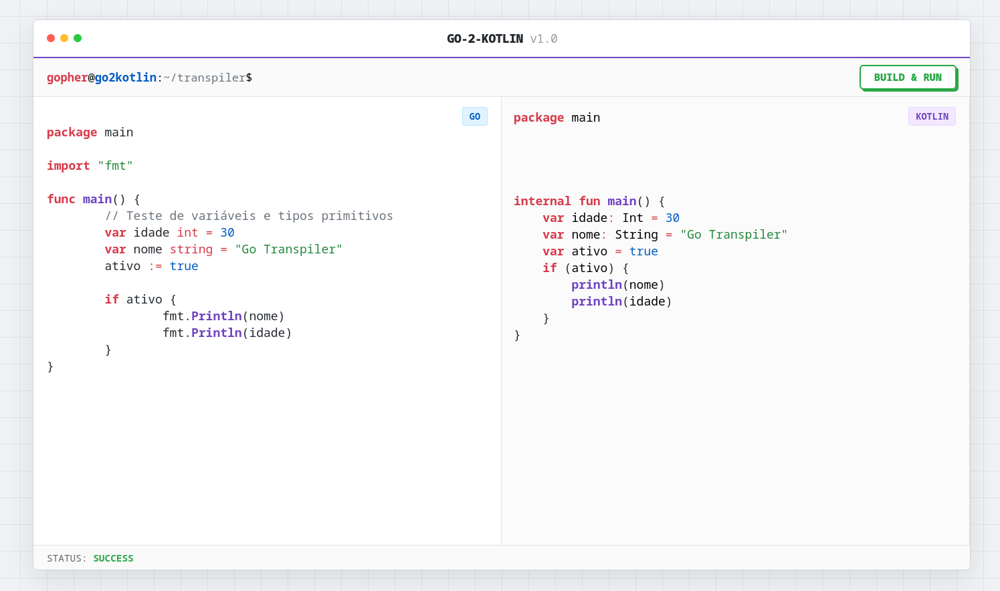

<p align="center">  </p> <p align="center">    </p>

# Projeto Acadêmico

Este projeto faz parte da disciplina Compiladores e Paradigmas de Programação, ministrada pelo professor Sebastião Filho, na Universidade do Estado do Rio Grande do Norte (UERN).

# Grupo de Desenvolvimento

- Paulo Sérgio

- Eduardo Marinho

- Marlos Emanuel

- Vinicius Eduardo

- Luiz Henrique

# Sobre o Projeto

O Go2Kotlin Transpiler é um transpilador source-to-source que converte código Golang → Kotlin, mantendo a lógica, estrutura do código original.

## Arquitetura do Projeto

Este projeto não cria binários executáveis; ele traduz a **Árvore Sintática Abstrata (AST)** de uma linguagem para outra.
Abaixo está a visão geral de como o sistema funciona internamente.

## 1. Fluxo de Dados (Pipeline)

O processo segue uma linha de montagem linear:

1. **Input (String)**
   O servidor recebe o código Go via requisição HTTP.

2. **Parsing (Análise)**
   Utiliza o pacote nativo `go/parser` para gerar a AST.

   > A AST é uma árvore onde o código deixa de ser texto e vira nós lógicos
   > (ex.: “Declaração de Função”, “Bloco If”).

3. **Traversal (Visita)**
   O arquivo `visitor.go` percorre cada nó da árvore recursivamente.

4. **Generation (Síntese)**
   O `writer.go` reconstrói a lógica usando a sintaxe do Kotlin.

## 2. Responsabilidade dos Módulos

O projeto segue o Standard Go Project Layout para melhor organização:

### **cmd/server/main.go**

* Porta de entrada da aplicação.
* Gerencia o servidor e serve a interface Web.
* Recebe o JSON do frontend e chama o pacote transpiler.

### **pkg/transpiler/**

Este pacote contém toda a lógica "core" do compilador:

* visitor.go: O “cérebro” do sistema. Contém o switch que analisa os nós da AST (converte ast.IfStmt → if, etc.).

* types.go: Implementa a tabela de conversão de tipos (int → Int, float64 → Double).

* writer.go: Responsável pela formatação, indentação e geração da string final em Kotlin.

## 3. Status da Implementação

O projeto implementa o **Subset Inicial** da linguagem.

### Implementado (Funcional)

* **Tipos Primitivos:** `int`, `string`, `bool`, `float`.
* **Controle de Fluxo:** `if/else` com parênteses obrigatórios do Kotlin.
* **Loops Seguros:**
  `for` (Go) → bloco `run { while(...) }` para preservar escopo.
* **Funções:**

  * Conversão de sintaxe: `nome tipo` → `nome: Tipo`
  * Conversão de visibilidade: `Func` → `public`, `func` → `internal`
* **Visual Mirroring:**
  O código Kotlin mantém alinhamento vertical do código Go original.

## Limitações Atuais (Roadmap)

* Goroutines/Channels: Suporte experimental (mapeado para Coroutines/Channels).

* Structs / OO: Métodos com receiver viram Extension Functions.

* Tratamento de Erros: Retornos múltiplos (Data, error) ainda precisam de ajustes manuais.

## Como Rodar

### Pré-requisitos

* Go **1.20+**

### Execução

Clone o repositório e, na raiz, execute:

```sh
go run cmd/server/main.go
```

Acesse no navegador:

```
http://localhost:8080
```

## Estrutura de Pastas

```
/
├── cmd/
│   └── server/
│       └── main.go          # Entry point do servidor
│
├── pkg/
│   └── transpiler/          # Lógica CORE do compilador
│       ├── visitor.go
│       ├── writer.go
│       └── types.go
│
├── web/                     # Frontend da Aplicação
│   ├── templates/
│   │   └── index.html       # Editor Web
│   └── static/
│       └── img/             # Assets (Imagens)
│
├── examples/                # Casos de teste
└── README.md                # Documentação

```